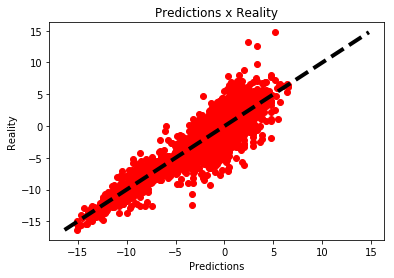

# TEAM SAKHIR
## Weather forcast - Challenge


```python
import numpy as np
import pandas as pd
from time import time
import datetime
from math import sqrt
import pickle
import matplotlib.pyplot as plt
from sklearn.model_selection import train_test_split
from sklearn.metrics import mean_squared_error, explained_variance_score
from sklearn.preprocessing import StandardScaler, Imputer
from sklearn.ensemble import RandomForestRegressor, GradientBoostingRegressor, AdaBoostRegressor
import xgboost as xgb
from xgboost import plot_importance
from keras.models import Sequential, load_model
from keras.layers.core import Dense, Dropout
from keras.optimizers import RMSprop

t0 = time()
```

    C:\Users\mbriens\AppData\Local\Continuum\Anaconda3\lib\site-packages\sklearn\cross_validation.py:41: DeprecationWarning: This module was deprecated in version 0.18 in favor of the model_selection module into which all the refactored classes and functions are moved. Also note that the interface of the new CV iterators are different from that of this module. This module will be removed in 0.20.
      "This module will be removed in 0.20.", DeprecationWarning)
    Using TensorFlow backend.
    

L'objectif de ce projet est de prédire correctement les prévisions météorologoiques en matière de températures, et ce dans 7 grandes villes de France.
Pour ce faire, il est possible d'appliquer des méthodes d'apprentissage automatique, qui permettent d'étudier finement les liens entre les variables à disposition, et la température à prédire, afin d'obtenir la prédiction la plus fiable possible.

Toutes les informations relatives à la compétitions peuvent être trouvées ici : https://defibigdata2018.insa-toulouse.fr/

Nous avons testé de nombreuses méthodes, tant au niveau de l'imputation des valeurs manquantes, de la suppression des valeurs extrêmes (outliers), que de la modélisation des méthodes de prédictions. Nous avons utilisé à la fois R et Python.

Les méthodes que nous avons retenues à terme ont été codées sur Python, et c'est ce pourquoi le rapport final prends cette forme. Cependant des commentaires préciserons certaines autres méthodes qui ont été tentées en parallèle de celles codées ici.

## I. Load data 

La première étape est de charger les données. Les données d'apprentissage étant réparties en 36 fichiers, correspondant aux 36 échéances à prédire, il a fallu regrouper ces données. De plus, pour simplifier les étapes de pré-processing, il est intéressant de regrouper les données d'apprentissage, et celles de test (sans oublier de les annoter, pour pouvoir les séparer avant l'étape de modélisation).


```python
Train = []
for i in range(1, 37):
    Train.append(pd.read_csv('C:/Users/mbriens/Documents/M2/Apprentissage/Projet/GIT/Sakhir/data/train/train_{}.csv'.format(i), sep=';', decimal=","))

train = pd.concat(Train)
train['test'] = 0

X_test = pd.read_csv('C:/Users/mbriens/Documents/M2/Apprentissage/Projet/GIT/Sakhir/data/test/test.csv', sep=';', decimal=",")
X_test['test'] = 1

df = pd.concat([train, X_test])

df['flvis1SOL0'] = df['flvis1SOL0'].apply(lambda x: float(str(x).replace(',', '.')))
df.head()
```


<div>
<style>
    .dataframe thead tr:only-child th {
        text-align: right;
    }

    .dataframe thead th {
        text-align: left;
    }

    .dataframe tbody tr th {
        vertical-align: top;
    }
</style>
<table border="1" class="dataframe">
  <thead>
    <tr style="text-align: right;">
      <th></th>
      <th>capeinsSOL0</th>
      <th>ciwcH20</th>
      <th>clwcH20</th>
      <th>date</th>
      <th>ddH10_rose4</th>
      <th>ech</th>
      <th>ffH10</th>
      <th>flir1SOL0</th>
      <th>fllat1SOL0</th>
      <th>flsen1SOL0</th>
      <th>...</th>
      <th>tH2</th>
      <th>tH2_VGrad_2.100</th>
      <th>tH2_XGrad</th>
      <th>tH2_YGrad</th>
      <th>tH2_obs</th>
      <th>test</th>
      <th>tpwHPA850</th>
      <th>ux1H10</th>
      <th>vapcSOL0</th>
      <th>vx1H10</th>
    </tr>
  </thead>
  <tbody>
    <tr>
      <th>0</th>
      <td>0.198757</td>
      <td>0.0</td>
      <td>0.000000</td>
      <td>2014-01-01</td>
      <td>4.0</td>
      <td>1</td>
      <td>1.970260</td>
      <td>-386960.595711</td>
      <td>-94260.682523</td>
      <td>-40545.510054</td>
      <td>...</td>
      <td>9.034338</td>
      <td>-0.084999</td>
      <td>0.007725</td>
      <td>-0.013024</td>
      <td>5.5</td>
      <td>0</td>
      <td>3.852825</td>
      <td>1.330320</td>
      <td>10.664653</td>
      <td>-2.853134</td>
    </tr>
    <tr>
      <th>1</th>
      <td>8.590036</td>
      <td>0.0</td>
      <td>0.000000</td>
      <td>2014-01-01</td>
      <td>3.0</td>
      <td>1</td>
      <td>2.755962</td>
      <td>-200181.123871</td>
      <td>2282.951687</td>
      <td>14399.918192</td>
      <td>...</td>
      <td>3.853128</td>
      <td>1.396138</td>
      <td>0.005036</td>
      <td>0.000810</td>
      <td>4.8</td>
      <td>0</td>
      <td>8.476699</td>
      <td>-2.040020</td>
      <td>15.462043</td>
      <td>3.019614</td>
    </tr>
    <tr>
      <th>2</th>
      <td>69.203856</td>
      <td>0.0</td>
      <td>0.000001</td>
      <td>2014-01-01</td>
      <td>3.0</td>
      <td>1</td>
      <td>3.411283</td>
      <td>-62310.340297</td>
      <td>9483.691316</td>
      <td>64790.365136</td>
      <td>...</td>
      <td>8.585184</td>
      <td>0.387329</td>
      <td>0.001372</td>
      <td>0.000010</td>
      <td>8.9</td>
      <td>0</td>
      <td>7.643070</td>
      <td>3.029610</td>
      <td>17.343600</td>
      <td>4.889849</td>
    </tr>
    <tr>
      <th>3</th>
      <td>65.270316</td>
      <td>0.0</td>
      <td>0.000000</td>
      <td>2014-01-01</td>
      <td>3.0</td>
      <td>1</td>
      <td>4.655633</td>
      <td>-61612.120075</td>
      <td>-48356.475831</td>
      <td>127450.659115</td>
      <td>...</td>
      <td>7.304130</td>
      <td>-0.089267</td>
      <td>0.000401</td>
      <td>-0.000067</td>
      <td>6.8</td>
      <td>0</td>
      <td>7.089030</td>
      <td>-1.027446</td>
      <td>13.981847</td>
      <td>8.079973</td>
    </tr>
    <tr>
      <th>4</th>
      <td>5.932505</td>
      <td>0.0</td>
      <td>0.000000</td>
      <td>2014-01-01</td>
      <td>3.0</td>
      <td>1</td>
      <td>5.855930</td>
      <td>-39553.109955</td>
      <td>-1022.914242</td>
      <td>117800.171480</td>
      <td>...</td>
      <td>5.829715</td>
      <td>-0.489606</td>
      <td>0.000204</td>
      <td>-0.000191</td>
      <td>5.4</td>
      <td>0</td>
      <td>4.546075</td>
      <td>2.802554</td>
      <td>9.941609</td>
      <td>7.955489</td>
    </tr>
  </tbody>
</table>
<p>5 rows × 32 columns</p>
</div>


Avant de faire quoique ce soit de plus, il est très important de visualiser les données à notre disposition, pour mieux en comprendre le sens. Cela peut permettre de commencer à appréhender les liens entre différentes variables, ainsi que de mettre en avant quelques variables susceptibmles d'avoir davantage de sens que d'autres.

Le code suivant permet de visualiser quelques variables les unes par rapport aux autres. Les données, tout comme les variables, étant assez nombreuses, le code n'a pas été exécuté ici. De plus, la majeure partie du travail d'exploration des données a été fait sur R.


```python
# plt.figure(figsize=(15,10))
# sns.pairplot(df[0:200], hue='insee')
# plt.show()
# g = sns.pairplot(df['Pclass', 'Sex', 'Age', 'Parch', 'Fare', 'Embarked'],
#                  hue='Survived',
#                  palette = 'seismic',
#                  size=1.2,
#                  diag_kind='kde',
#                  diag_kws=dict(shade=True),
#                  plot_kws=dict(s=10))
# g.set(xticklabels=[])
```

Nous remarquons d'aillieurs que les variables 'tH2', et 'tH2_obs' sont très corrélées. Cette information est capitale, puisque c'estr  la variable 'tH2' que nous souhaitons prédire. En réalité, la variable 'tH2_obs' correspond à la prédiction effectuée par l'un des modèle de Météo France. La prédiction que nous devons effectuer doit améliorer la précision de ce modèle.

C'est d'aillieurs ainsi que nous avons pu constater une anomalie au sein des données : nous n'avons que de très rares observations pour les échéances supérieures à 30 dans le jeu d'apprentissage.

Cela a posé quelques problèmes, car nous n'avions pas toujours 36 observations pour un même jour : les informations étaient parfois tronquées. Lorsque nous avons tenté de mettre en place une régression linéaire à effets mixtes sur R (par localisation, et par suite d'échéances), il n'a pas été possible de l'appliquer sur les données, a cause de ce manque d'informations.

## II. Add data

Les données dont nous disposons peuvent être modifiées, ou de nouvelles informations peuvent en être déduites. Cela pouvant apporter de la précision lors de la modélisation, nous avons décidé d'apporter des modifications, telles que l'ajout d'informations relatives à la saison de l'observation, ou de l'emplacement des villes étudiées, ainsi que quelques informations météorologiques sur celles-ci.

De plus, certaines variables (ici ne restent que la saison et l'année, mais dans le cas ou l'emplacement des villes n'aurait pas été recodé par les latitudes et longitudes de celles-ci, la variable du code insee des villes aurait été concernée également) ne sont pas continues. Afin de pouvoir traiter les variables qualitatives, il est nécessaire de les binariser : c'est-à-dire créer, pour chaque variable, autant de nouvelles variables que de modalités, et de les remplir par des valeurs binaires. La fonction 'get_dummies' permet d'appliquer facilement ces modifications, pour éviter tout problème de confusion par la suite.


```python
df['seasons'] = df['mois'].map({'janvier': 'hiver', 'février': 'hiver', 'mars': 'printemps', 'avril': 'printemps', 'mai': 'printemps', 'juin': 'été', 'juillet': 'été', "août": "été", "septembre": "automne", "octobre": "automne", "novembre": "automne", "décembre": "hiver"})
df['year'] = df['date'].apply(lambda x: x[:4])

df['city'] = df['insee'].map({6088001: 'Nice', 31069001: 'Toulouse', 33281001: 'Bordeaux', 35281001: 'Rennes', 59343001: 'Lille', 67124001: 'Strasbourg', 75114001: 'Paris'})
df['lat'] = df['city'].map({'Nice': 43.66510, 'Toulouse': 43.63799, 'Bordeaux': 44.83137, 'Rennes': 48.06560, 'Lille': 50.57178, 'Strasbourg': 48.53943, 'Paris': 48.82231})
df['lon'] = df['city'].map({'Nice': 7.2133184, 'Toulouse': 1.3719825, 'Bordeaux': -0.6920608, 'Rennes': -1.7232451, 'Lille': 3.1060870, 'Strasbourg': 7.6280226, 'Paris': 2.3378563})
df['fleuve'] = df['city'].map({'Nice': 0, 'Toulouse': 1, 'Bordeaux': 1, 'Rennes': 0, 'Lille': 0, 'Strasbourg': 1, 'Paris': 1})
df['distmer'] = df['city'].map({'Nice': 0, 'Toulouse': 150, 'Bordeaux': 65, 'Rennes': 70, 'Lille': 80, 'Strasbourg': 540, 'Paris': 200})

# Source : http://www.linternaute.com/voyage/climat/comparaison/toulouse/rennes/2015/ville-31555/ville-35238
df['ensoleillement16'] = df['city'].map({'Nice': 2771, 'Toulouse': 2100, 'Bordeaux': 2022, 'Rennes': 1679, 'Lille': 1653, 'Strasbourg': 1625, 'Paris': 1726})
df['ensoleillement15'] = df['city'].map({'Nice': 2917, 'Toulouse': 2238, 'Bordeaux': 2151, 'Rennes': 1851, 'Lille': 1739, 'Strasbourg': 1886, 'Paris': 1953})
df['precipitations16'] = df['city'].map({'Nice': 484, 'Toulouse': 577, 'Bordeaux': 922, 'Rennes': 625, 'Lille': 836, 'Strasbourg': 730, 'Paris': 658})
df['precipitations15'] = df['city'].map({'Nice': 669, 'Toulouse': 511, 'Bordeaux': 592, 'Rennes': 596, 'Lille': 786, 'Strasbourg': 475, 'Paris': 507})

df = pd.concat([df, pd.get_dummies(df[['seasons', 'year']])], axis=1)
df = df.drop('seasons', 1)
df = df.drop('mois', 1)
df = df.drop('year', 1)
df = df.drop('city', 1)
```


```python
df.head()
```


<div>
<style>
    .dataframe thead tr:only-child th {
        text-align: right;
    }

    .dataframe thead th {
        text-align: left;
    }

    .dataframe tbody tr th {
        vertical-align: top;
    }
</style>
<table border="1" class="dataframe">
  <thead>
    <tr style="text-align: right;">
      <th></th>
      <th>capeinsSOL0</th>
      <th>ciwcH20</th>
      <th>clwcH20</th>
      <th>date</th>
      <th>ddH10_rose4</th>
      <th>ech</th>
      <th>ffH10</th>
      <th>flir1SOL0</th>
      <th>fllat1SOL0</th>
      <th>flsen1SOL0</th>
      <th>...</th>
      <th>precipitations16</th>
      <th>precipitations15</th>
      <th>seasons_automne</th>
      <th>seasons_hiver</th>
      <th>seasons_printemps</th>
      <th>seasons_été</th>
      <th>year_2014</th>
      <th>year_2015</th>
      <th>year_2016</th>
      <th>year_2017</th>
    </tr>
  </thead>
  <tbody>
    <tr>
      <th>0</th>
      <td>0.198757</td>
      <td>0.0</td>
      <td>0.000000</td>
      <td>2014-01-01</td>
      <td>4.0</td>
      <td>1</td>
      <td>1.970260</td>
      <td>-386960.595711</td>
      <td>-94260.682523</td>
      <td>-40545.510054</td>
      <td>...</td>
      <td>484</td>
      <td>669</td>
      <td>0</td>
      <td>1</td>
      <td>0</td>
      <td>0</td>
      <td>1</td>
      <td>0</td>
      <td>0</td>
      <td>0</td>
    </tr>
    <tr>
      <th>1</th>
      <td>8.590036</td>
      <td>0.0</td>
      <td>0.000000</td>
      <td>2014-01-01</td>
      <td>3.0</td>
      <td>1</td>
      <td>2.755962</td>
      <td>-200181.123871</td>
      <td>2282.951687</td>
      <td>14399.918192</td>
      <td>...</td>
      <td>577</td>
      <td>511</td>
      <td>0</td>
      <td>1</td>
      <td>0</td>
      <td>0</td>
      <td>1</td>
      <td>0</td>
      <td>0</td>
      <td>0</td>
    </tr>
    <tr>
      <th>2</th>
      <td>69.203856</td>
      <td>0.0</td>
      <td>0.000001</td>
      <td>2014-01-01</td>
      <td>3.0</td>
      <td>1</td>
      <td>3.411283</td>
      <td>-62310.340297</td>
      <td>9483.691316</td>
      <td>64790.365136</td>
      <td>...</td>
      <td>922</td>
      <td>592</td>
      <td>0</td>
      <td>1</td>
      <td>0</td>
      <td>0</td>
      <td>1</td>
      <td>0</td>
      <td>0</td>
      <td>0</td>
    </tr>
    <tr>
      <th>3</th>
      <td>65.270316</td>
      <td>0.0</td>
      <td>0.000000</td>
      <td>2014-01-01</td>
      <td>3.0</td>
      <td>1</td>
      <td>4.655633</td>
      <td>-61612.120075</td>
      <td>-48356.475831</td>
      <td>127450.659115</td>
      <td>...</td>
      <td>625</td>
      <td>596</td>
      <td>0</td>
      <td>1</td>
      <td>0</td>
      <td>0</td>
      <td>1</td>
      <td>0</td>
      <td>0</td>
      <td>0</td>
    </tr>
    <tr>
      <th>4</th>
      <td>5.932505</td>
      <td>0.0</td>
      <td>0.000000</td>
      <td>2014-01-01</td>
      <td>3.0</td>
      <td>1</td>
      <td>5.855930</td>
      <td>-39553.109955</td>
      <td>-1022.914242</td>
      <td>117800.171480</td>
      <td>...</td>
      <td>836</td>
      <td>786</td>
      <td>0</td>
      <td>1</td>
      <td>0</td>
      <td>0</td>
      <td>1</td>
      <td>0</td>
      <td>0</td>
      <td>0</td>
    </tr>
  </tbody>
</table>
<p>5 rows × 47 columns</p>
</div>


## III. Deal with missing values

De nombreuses valeurs manquantes ont été observées dans les données, tant dans le jeu d'apprentissage que dans le jeu de test. Certaines variables sont plus concernées que d'autres. C'est notamment le cas de la variable 'capeinsSOL0', pour laquelle on observe un fort taux de valeurs manquantes, au sein de l'échantillon d'apprentissage.

Même s'il est question de réfléchir à une méthode pour imputer les valeurs manquantes, remplacer autant de valeurs manquantes pourrait créer un biais dans nos données. Dans un premier temps, nous avons donc décidé de retirer toutes les variables ayant plus de 5% de valeurs manquantes. Nous avons également utilisé le package 'MICE' de R, afin d'imputer les variables.

Plusieurs méthodes (de nombreuses méthodes d'imputations sont disponibles à partir du package 'MICE') ont été testées, telles que les méthodes 'pmm' (predictive mean matching), ou 'cart' (basée sur des arbres de décision). Finalement, il semble que des résultats très satisfaisants soient obtenus à partir d'une simple imputation par moyenne. C'est donc ce qui est effectué dans le code suivant (l'imputation est effectuée conjointement sur l'échantillon d'apprentissage et de test, pour plus de cohérence).


```python
df.isnull().sum()
```


    capeinsSOL0          18788
    ciwcH20                973
    clwcH20               4480
    date                     0
    ddH10_rose4           4578
    ech                      0
    ffH10                 4578
    flir1SOL0             1260
    fllat1SOL0            1159
    flsen1SOL0            1227
    flvis1SOL0            1197
    hcoulimSOL0            973
    huH2                  4557
    insee                    0
    iwcSOL0                973
    nH20                 10787
    nbSOL0_HMoy            987
    ntSOL0_HMoy            987
    pMER0                 4809
    rr1SOL0               3955
    rrH20                 4487
    tH2                   4557
    tH2_VGrad_2.100       4564
    tH2_XGrad             4557
    tH2_YGrad             4557
    tH2_obs              21188
    test                     0
    tpwHPA850             1022
    ux1H10                4578
    vapcSOL0               994
    vx1H10                4564
    lat                      0
    lon                      0
    fleuve                   0
    distmer                  0
    ensoleillement16         0
    ensoleillement15         0
    precipitations16         0
    precipitations15         0
    seasons_automne          0
    seasons_hiver            0
    seasons_printemps        0
    seasons_été              0
    year_2014                0
    year_2015                0
    year_2016                0
    year_2017                0
    dtype: int64


```python
numeric_features = ['tH2', 'capeinsSOL0', 'ciwcH20', 'clwcH20', 'nH20',
                    'pMER0', 'rr1SOL0', 'rrH20', 'tpwHPA850', 'ux1H10',
                    'vapcSOL0', 'vx1H10', 'ddH10_rose4', 'ffH10', 'flir1SOL0',
                    'fllat1SOL0', 'flsen1SOL0', 'flvis1SOL0', 'hcoulimSOL0',
                    'huH2', 'iwcSOL0', 'nbSOL0_HMoy', 'ntSOL0_HMoy',
                    'tH2_VGrad_2.100', 'tH2_XGrad', 'tH2_YGrad']
qualitative_features = ['insee', 'mois']
imput = Imputer(missing_values='NaN', strategy='mean', axis=0)
imput.fit(df[numeric_features])
df[numeric_features] = imput.transform(df[numeric_features])

numeric_features.remove('tH2')

scale_num = StandardScaler()
scale_num.fit(df[numeric_features])
df[numeric_features] = scale_num.transform(df[numeric_features])
```


```python
df.head()
```


<div>
<style>
    .dataframe thead tr:only-child th {
        text-align: right;
    }

    .dataframe thead th {
        text-align: left;
    }

    .dataframe tbody tr th {
        vertical-align: top;
    }
</style>
<table border="1" class="dataframe">
  <thead>
    <tr style="text-align: right;">
      <th></th>
      <th>capeinsSOL0</th>
      <th>ciwcH20</th>
      <th>clwcH20</th>
      <th>date</th>
      <th>ddH10_rose4</th>
      <th>ech</th>
      <th>ffH10</th>
      <th>flir1SOL0</th>
      <th>fllat1SOL0</th>
      <th>flsen1SOL0</th>
      <th>...</th>
      <th>precipitations16</th>
      <th>precipitations15</th>
      <th>seasons_automne</th>
      <th>seasons_hiver</th>
      <th>seasons_printemps</th>
      <th>seasons_été</th>
      <th>year_2014</th>
      <th>year_2015</th>
      <th>year_2016</th>
      <th>year_2017</th>
    </tr>
  </thead>
  <tbody>
    <tr>
      <th>0</th>
      <td>-0.436028</td>
      <td>-0.047738</td>
      <td>-0.169298</td>
      <td>2014-01-01</td>
      <td>1.204948</td>
      <td>1</td>
      <td>-0.676134</td>
      <td>-1.251936</td>
      <td>0.237479</td>
      <td>0.154694</td>
      <td>...</td>
      <td>484</td>
      <td>669</td>
      <td>0</td>
      <td>1</td>
      <td>0</td>
      <td>0</td>
      <td>1</td>
      <td>0</td>
      <td>0</td>
      <td>0</td>
    </tr>
    <tr>
      <th>1</th>
      <td>-0.375665</td>
      <td>-0.047738</td>
      <td>-0.169298</td>
      <td>2014-01-01</td>
      <td>0.308010</td>
      <td>1</td>
      <td>-0.286001</td>
      <td>0.139384</td>
      <td>0.641719</td>
      <td>0.382360</td>
      <td>...</td>
      <td>577</td>
      <td>511</td>
      <td>0</td>
      <td>1</td>
      <td>0</td>
      <td>0</td>
      <td>1</td>
      <td>0</td>
      <td>0</td>
      <td>0</td>
    </tr>
    <tr>
      <th>2</th>
      <td>0.060368</td>
      <td>-0.047738</td>
      <td>-0.141592</td>
      <td>2014-01-01</td>
      <td>0.308010</td>
      <td>1</td>
      <td>0.039393</td>
      <td>1.166383</td>
      <td>0.671869</td>
      <td>0.591152</td>
      <td>...</td>
      <td>922</td>
      <td>592</td>
      <td>0</td>
      <td>1</td>
      <td>0</td>
      <td>0</td>
      <td>1</td>
      <td>0</td>
      <td>0</td>
      <td>0</td>
    </tr>
    <tr>
      <th>3</th>
      <td>0.032072</td>
      <td>-0.047738</td>
      <td>-0.169298</td>
      <td>2014-01-01</td>
      <td>0.308010</td>
      <td>1</td>
      <td>0.657263</td>
      <td>1.171584</td>
      <td>0.429686</td>
      <td>0.850785</td>
      <td>...</td>
      <td>625</td>
      <td>596</td>
      <td>0</td>
      <td>1</td>
      <td>0</td>
      <td>0</td>
      <td>1</td>
      <td>0</td>
      <td>0</td>
      <td>0</td>
    </tr>
    <tr>
      <th>4</th>
      <td>-0.394782</td>
      <td>-0.047738</td>
      <td>-0.169298</td>
      <td>2014-01-01</td>
      <td>0.308010</td>
      <td>1</td>
      <td>1.253260</td>
      <td>1.335902</td>
      <td>0.627877</td>
      <td>0.810798</td>
      <td>...</td>
      <td>836</td>
      <td>786</td>
      <td>0</td>
      <td>1</td>
      <td>0</td>
      <td>0</td>
      <td>1</td>
      <td>0</td>
      <td>0</td>
      <td>0</td>
    </tr>
  </tbody>
</table>
<p>5 rows × 47 columns</p>
</div>


## IV. Split train & test and prepare for modeling

Avant de passer à la modélisation, il reste à séparer les jeux de test et d'apprentissage.

D'autre part, il ne faut pas oublier que l'une des variables à notre disposition correspond à la prédiction faite par l'un des modèles de Météo-France, et est très corrélée à la variable à expliquer. Bien que cette corrélation soit très utile, il semble plus pertinent de ne pas prédire directement la température, mais plutot la correction à apporter à la prédiction faite par le modèle de Météo-France. C'est ce pourquoi nous avons créé la variable 'ecart', qui sera donc notre variable cible.


```python
X_test = df[df['test'] == 1].drop('test', 1)
train = df[df['test'] == 0].drop('test', 1)
date = train['date']


def to_time(date):
    return datetime.datetime.strptime(date, '%Y-%m-%d').date()

train['date'] = date.map(to_time, date.all())

X_test_date = X_test['date']
X_test_ech = X_test['ech']
X_test_insee = X_test['insee']
X_test = X_test.drop('date', 1).drop('insee', 1).drop('tH2_obs', 1)

train['ecart'] = train['tH2_obs'] - train['tH2']
train['ecart'] = np.nan_to_num(train['ecart'])
print('Size of train : '+str(len(train)))

train = train.drop('tH2_obs', 1).drop('insee', 1).drop('date', 1)
```

    Size of train : 189280
    

## V. Delete outliers from train set (isolation forest)

Avant de procéder à la modélisation, nous avons fait quelques tentatives en supprimant les valeurs extrêmes, pouvant être considérées comme des outilers. Il semblait intéressant de ne restreindre l'apprentissage qu'aux individus les plus standards, pour améliorer la robustesse des modèles établis par la suite. Cependant, ce choix ne s'est pas avéré payant, puisque les essais ont conduit à de très mauvais scores.

Soit l'idée est critiquable, soit la méthode a été mal implémentée. Quoiqu'il en soit, voici le code qui a été testé.


```python
# clf = IsolationForest(max_samples = 100, random_state = 3)
# clf.fit(train)
# y_noano = clf.predict(train)
# y_noano = pd.DataFrame(y_noano, columns = ['Top'])
# y_noano[y_noano['Top'] == 1].index.values
# train = train.iloc[y_noano[y_noano['Top'] == 1].index.values]
# train.reset_index(drop = True, inplace = True)
# print("Number of Outliers:", y_noano[y_noano['Top'] == -1].shape[0])
# print("Number of rows without outliers:", train.shape[0])
```

## VI. Split train & validation sets

Avant de passer à la modélisation, il est indispensable de procéder à la création d'un échantillon d'apprentissage, et d'un échantillon de validation, afin d'éviter tout surapprentissage, et pour pouvoir tester nos modèle sur des données, pour avoir un aperçu de la précision de ces modèles.

Lors de la paramétrisation des différents modèles présentés ci-dessous, nous avons utilisé la validation croisée (5-fold la plupart du temps), afin de s'assurer que les mesures de précisions n'étaient pas trop dépendantes de l'échantillonnage, et ainsi, de s'assurer d'une certaine robustesse du modèle.


```python
y_train = train['ecart']
X_train = train.drop('ecart', 1)

X_train, X_val, y_train, y_val = train_test_split(X_train, y_train, test_size=0.20, random_state=42)
X_train.head()
```


<div>
<style>
    .dataframe thead tr:only-child th {
        text-align: right;
    }

    .dataframe thead th {
        text-align: left;
    }

    .dataframe tbody tr th {
        vertical-align: top;
    }
</style>
<table border="1" class="dataframe">
  <thead>
    <tr style="text-align: right;">
      <th></th>
      <th>capeinsSOL0</th>
      <th>ciwcH20</th>
      <th>clwcH20</th>
      <th>ddH10_rose4</th>
      <th>ech</th>
      <th>ffH10</th>
      <th>flir1SOL0</th>
      <th>fllat1SOL0</th>
      <th>flsen1SOL0</th>
      <th>flvis1SOL0</th>
      <th>...</th>
      <th>precipitations16</th>
      <th>precipitations15</th>
      <th>seasons_automne</th>
      <th>seasons_hiver</th>
      <th>seasons_printemps</th>
      <th>seasons_été</th>
      <th>year_2014</th>
      <th>year_2015</th>
      <th>year_2016</th>
      <th>year_2017</th>
    </tr>
  </thead>
  <tbody>
    <tr>
      <th>3326</th>
      <td>-0.256129</td>
      <td>-0.047738</td>
      <td>-0.169298</td>
      <td>0.308010</td>
      <td>9</td>
      <td>-1.445468</td>
      <td>-1.726048</td>
      <td>-0.854190</td>
      <td>-0.904759</td>
      <td>1.932188</td>
      <td>...</td>
      <td>577</td>
      <td>511</td>
      <td>0</td>
      <td>0</td>
      <td>1</td>
      <td>0</td>
      <td>0</td>
      <td>1</td>
      <td>0</td>
      <td>0</td>
    </tr>
    <tr>
      <th>3958</th>
      <td>-0.254942</td>
      <td>-0.047738</td>
      <td>0.141598</td>
      <td>0.308010</td>
      <td>30</td>
      <td>-0.275087</td>
      <td>1.493985</td>
      <td>0.468929</td>
      <td>0.232874</td>
      <td>-0.491594</td>
      <td>...</td>
      <td>625</td>
      <td>596</td>
      <td>0</td>
      <td>0</td>
      <td>0</td>
      <td>1</td>
      <td>0</td>
      <td>1</td>
      <td>0</td>
      <td>0</td>
    </tr>
    <tr>
      <th>4586</th>
      <td>-0.437437</td>
      <td>-0.047738</td>
      <td>-0.169298</td>
      <td>-0.588929</td>
      <td>16</td>
      <td>-0.393806</td>
      <td>-0.640181</td>
      <td>0.470015</td>
      <td>0.282513</td>
      <td>-0.281971</td>
      <td>...</td>
      <td>577</td>
      <td>511</td>
      <td>0</td>
      <td>1</td>
      <td>0</td>
      <td>0</td>
      <td>0</td>
      <td>1</td>
      <td>0</td>
      <td>0</td>
    </tr>
    <tr>
      <th>3548</th>
      <td>0.000000</td>
      <td>-0.047738</td>
      <td>-0.169298</td>
      <td>1.204948</td>
      <td>11</td>
      <td>-0.761269</td>
      <td>-3.020785</td>
      <td>-0.156576</td>
      <td>-4.557322</td>
      <td>3.265953</td>
      <td>...</td>
      <td>658</td>
      <td>507</td>
      <td>0</td>
      <td>0</td>
      <td>1</td>
      <td>0</td>
      <td>0</td>
      <td>1</td>
      <td>0</td>
      <td>0</td>
    </tr>
    <tr>
      <th>2670</th>
      <td>-0.279501</td>
      <td>-0.047738</td>
      <td>0.000000</td>
      <td>0.000000</td>
      <td>26</td>
      <td>0.000000</td>
      <td>0.001008</td>
      <td>0.653073</td>
      <td>0.485240</td>
      <td>-0.610856</td>
      <td>...</td>
      <td>625</td>
      <td>596</td>
      <td>0</td>
      <td>1</td>
      <td>0</td>
      <td>0</td>
      <td>0</td>
      <td>1</td>
      <td>0</td>
      <td>0</td>
    </tr>
  </tbody>
</table>
<p>5 rows × 43 columns</p>
</div>


```python
obj_save_path = 'C:/Users/mbriens/Documents/M2/Apprentissage/Projet/GIT/Sakhir/code/Python/obj_save/'
# pickle.dump((X_train, X_val, y_train, y_val), open(obj_save_path+'train_val_df.p', 'wb'))
X_train, X_val, y_train, y_val = pickle.load(open(obj_save_path+'train_val_df.p', 'rb'))
print('Ready to start ML part !')
```

    Ready to start ML part !
    

### A présent, passons à la modélisation des méthodes d'apprentissage !

Comme l'indique ce message apparu dans le code, les données sont fin prêtes : nous pouvons maintenant passer à l'étape de modélisation.

Avant d'entammer cette partie, il est nécessaire de préciser qu'en plus de la validation croisée (comme précisé plus haut), le code utilisé pour obtenir les paramètres choisis ici est différent du code présenté ici. Lors de l'étape de paramétrisation des modèles, nous avons par exemple utilisé les méthodes de 'GridSearchCV' (disponible à partir du package 'SKlearn'). Selon les méthodes en question, cette solution a pu s'avérer beaucoup trop gourmande en termes de temps de calcul. Par conséquents, la solution a été, dans la plupart des cas, de rechercher une a une la valeur idéale de chacun des paramètres par dichotomie, en fixant tous les autres paramètres. Cette méthode n'est pas parfaite, dans le cas d'effet conjoint de plusieurs paramètres sur la précision, mais cela nous a semblé être le compromis idéal, compte-tenu du temps alloué pour mener à bien ce projet.

Il est également nécessaire de préciser, comme il a été abordé plus haut, que les méthodes présentes dans le code suivant ne forment pas une liste exhaustive des méthodes qui ont pu être implémentées lors de ce projet. La première approche a été d'utiliser une régression linéaire, puis nous avons utilisé des variantes du modèle linéaire, comme le modèle à effets mixtes, la régression Lasso (L1 regularization), la régression Ridge (L2 regularization), l'arbre de décision. D'autre part, plusieurs méthodes renseignées ci-dessous ont été également été implémentées en R.

## VII. ML part 1 : Random Forest


```python
model_rf = RandomForestRegressor(n_estimators=500,
                                 max_depth=15,
                                 min_samples_split=40,
                                 min_samples_leaf=20,
                                 max_leaf_nodes=1750,
                                 bootstrap=True, oob_score=True,
                                 random_state=321, n_jobs=4, verbose=1)

# model_rf.fit(X_train, y_train)
```


```python
# pickle.dump(model_rf, open(obj_save_path+'model_rf.p', 'wb'))
model_rf = pickle.load(open(obj_save_path+'model_rf.p', 'rb'))
```


```python
def plot_imp_rf(model_rf, X):
    importances = model_rf.feature_importances_
    std = np.std([tree.feature_importances_ for tree in model_rf.estimators_],
                 axis=0)
    indices = np.argsort(importances)[::-1]
    names = X.columns[indices]
    # Print the feature ranking
    print("Feature ranking:")
    for f in range(X.shape[1]):
        print(str(f+1)+'. feature '+str(names[f])+' ('+str(importances[indices[f]])+')')
    # Plot the feature importances of the forest
    plt.figure(figsize=(15, 10))
    plt.title("Feature importances")
    plt.bar(range(X.shape[1]), importances[indices], color="r", yerr=std[indices], align="center")
    plt.xticks(range(X.shape[1]), names, rotation=80)
    plt.xlim([-1, X.shape[1]])
    plt.show()
```


```python
plot_imp_rf(model_rf, X_train)
# oob_error = 1 - model_rf.oob_score_
```

    Feature ranking:
    1. feature clwcH20 (0.278107357996)
    2. feature huH2 (0.146541521698)
    3. feature tH2_YGrad (0.114940360956)
    4. feature vapcSOL0 (0.0901348832061)
    5. feature tpwHPA850 (0.0814500591217)
    6. feature fllat1SOL0 (0.0378062580368)
    7. feature tH2_VGrad_2.100 (0.03307119752)
    8. feature tH2 (0.0254516493694)
    9. feature ech (0.0198410073098)
    10. feature ensoleillement16 (0.0148959559549)
    11. feature flvis1SOL0 (0.0136281059289)
    12. feature pMER0 (0.011840304736)
    13. feature hcoulimSOL0 (0.0115236231505)
    14. feature ensoleillement15 (0.010357924431)
    15. feature flsen1SOL0 (0.0089656369418)
    16. feature vx1H10 (0.00823759574541)
    17. feature flir1SOL0 (0.00800338960758)
    18. feature nbSOL0_HMoy (0.00788323066255)
    19. feature ntSOL0_HMoy (0.00754626891039)
    20. feature capeinsSOL0 (0.00745352766691)
    21. feature ux1H10 (0.00738502541867)
    22. feature ffH10 (0.00605813127259)
    23. feature distmer (0.00602230258023)
    24. feature precipitations16 (0.00543399342301)
    25. feature ciwcH20 (0.00530383699639)
    26. feature tH2_XGrad (0.00526645978139)
    27. feature lon (0.00389312832108)
    28. feature precipitations15 (0.00370513280524)
    29. feature rr1SOL0 (0.00254155138648)
    30. feature year_2014 (0.00225590187957)
    31. feature seasons_printemps (0.00220278383084)
    32. feature nH20 (0.0018224114489)
    33. feature lat (0.00175517171248)
    34. feature seasons_automne (0.00168921507522)
    35. feature seasons_hiver (0.00163901887073)
    36. feature iwcSOL0 (0.00128485262553)
    37. feature year_2016 (0.00112878897989)
    38. feature ddH10_rose4 (0.00110880286212)
    39. feature year_2015 (0.000711828065153)
    40. feature rrH20 (0.000397204111268)
    41. feature fleuve (0.000370217972329)
    42. feature seasons_été (0.000344381630005)
    43. feature year_2017 (0.0)
    


```python
def verif_valid(model, X_val, y_val):
    if type(model) == Sequential:
        X_val = np.array(X_val)
    reality = y_val
    predictions = model.predict(X_val)
    if len(predictions.shape) == 2:
        predictions = predictions[:, 0]
    plt.hist(predictions)
    plt.title('Histogram of Predictions')
    plt.show()
    plt.plot(predictions, reality, 'ro')
    plt.xlabel('Predictions')
    plt.ylabel('Reality')
    plt.title('Predictions x Reality')
    plt.plot([reality.min(), reality.max()], [reality.min(), reality.max()], 'k--', lw=4)
    plt.show()
    if type(model) != Sequential:
        print('Explained var (total) = '+str(explained_variance_score(X_val['tH2']+predictions, X_val['tH2']+reality)))
    print('Explained var (predictions) = '+str(explained_variance_score(reality, predictions)))
    print('RMSE = '+str(sqrt(mean_squared_error(reality, predictions))))
```


```python
verif_valid(model_rf, X_val, y_val)
```

    [Parallel(n_jobs=4)]: Done  42 tasks      | elapsed:    0.1s
    [Parallel(n_jobs=4)]: Done 192 tasks      | elapsed:    1.0s
    [Parallel(n_jobs=4)]: Done 442 tasks      | elapsed:    2.3s
    [Parallel(n_jobs=4)]: Done 500 out of 500 | elapsed:    2.5s finished
    


    Explained var (total) = 0.967780824774
    Explained var (predictions) = 0.67463212966
    RMSE = 1.1059303031248067
    


```python
print('ML part. I : Random Forest, done !')
```

    ML part. I : Random Forest, done !
    

## VIII. ML part 2 : XGBoost


```python
model_xgb = xgb.XGBRegressor(base_score=0.5,
                             subsample=0.8,
                             max_delta_step=2,
                             max_depth=7,
                             min_child_weight=3,
                             n_estimators=580,
                             colsample_bytree=0.85,
                             gamma=0,
                             seed=321, silent=0)

# model_xgb.fit(X_train, y_train)
```


```python
# pickle.dump(model_xgb, open(obj_save_path+'model_xgb.p', 'wb'))
model_xgb = pickle.load(open(obj_save_path+'model_xgb.p', 'rb'))
```


```python
plot_importance(model_xgb)
plt.show()
```


```python
verif_valid(model_xgb, X_val, y_val)
```





    Explained var (total) = 0.972229075438
    Explained var (predictions) = 0.718366771585
    RMSE = 1.0289219361794313
    

## IX. ML part 3 : Adaboost


```python
model_adab = AdaBoostRegressor(base_estimator=RandomForestRegressor(),
                               n_estimators=300,
                               learning_rate=0.28,
                               loss='linear',
                               random_state=321)

# model_adab.fit(X_train, y_train)
```


```python
# pickle.dump(model_adab, open(obj_save_path+'model_adab.p', 'wb'))
model_adab = pickle.load(open(obj_save_path+'model_adab.p', 'rb'))
```


```python
verif_valid(model_adab, X_val, y_val)
```


    Explained var (total) = 0.973218198411
    Explained var (predictions) = 0.729401501269
    RMSE = 1.0086116177242193
    

## X. ML part 4 : Gradient Boosting


```python
model_gradb = GradientBoostingRegressor(loss='huber',
                                        alpha=0.9,
                                        learning_rate=0.6,
                                        n_estimators=500,
                                        subsample=0.9,
                                        min_samples_leaf=450,
                                        max_depth=6,
                                        random_state=321, verbose=0)

# model_gradb.fit(X_train, y_train)
```


```python
# pickle.dump(model_gradb, open(obj_save_path+'model_gradb.p', 'wb'))
model_gradb = pickle.load(open(obj_save_path+'model_gradb.p', 'rb'))
```


```python
verif_valid(model_gradb, X_val, y_val)
```


    Explained var (total) = 0.969804283933
    Explained var (predictions) = 0.691687293474
    RMSE = 1.07659680706495
    

## XI. ML part 5 : Neural Network


```python
scale_x = StandardScaler()
scale_x.fit(X_train)
X_train_scale = pd.DataFrame(scale_x.transform(X_train))
X_val_scale = pd.DataFrame(scale_x.transform(X_val))
```


```python
def nn_model():
    seed = 321
    np.random.seed(seed)
    rmsprop = RMSprop(lr=0.0001)
    # sgd=SGD(lr=0.1)
    # kfold = StratifiedKFold(n_splits=5, shuffle=True, random_state=seed)
    # for train, test in kfold.split(X, y):
    model_nn = Sequential()
    model_nn.add(Dense(300, input_dim=43, activation='relu', kernel_initializer='normal'))
    model_nn.add(Dropout(0.3))
    model_nn.add(Dense(200, activation='relu', kernel_initializer='normal'))
    model_nn.add(Dropout(0.3))
    model_nn.add(Dense(150, activation='relu', kernel_initializer='normal'))
    model_nn.add(Dropout(0.2))
    model_nn.add(Dense(1, kernel_initializer='normal'))
    # Compile model
    model_nn.compile(optimizer=rmsprop, loss='mean_squared_error')
    return model_nn
```


```python
model_nn = nn_model()
model_nn.summary()
```

    _________________________________________________________________
    Layer (type)                 Output Shape              Param #   
    =================================================================
    dense_1 (Dense)              (None, 300)               13200     
    _________________________________________________________________
    dropout_1 (Dropout)          (None, 300)               0         
    _________________________________________________________________
    dense_2 (Dense)              (None, 200)               60200     
    _________________________________________________________________
    dropout_2 (Dropout)          (None, 200)               0         
    _________________________________________________________________
    dense_3 (Dense)              (None, 150)               30150     
    _________________________________________________________________
    dropout_3 (Dropout)          (None, 150)               0         
    _________________________________________________________________
    dense_4 (Dense)              (None, 1)                 151       
    =================================================================
    Total params: 103,701
    Trainable params: 103,701
    Non-trainable params: 0
    _________________________________________________________________
    


```python
hist = model_nn.fit(np.array(X_train_scale), np.array(y_train),
                    epochs=300, validation_split=0.33,
                    shuffle=True, verbose=1)
```

    Train on 101454 samples, validate on 49970 samples
    Epoch 1/300
    101454/101454 [==============================] - 28s - loss: 2.3052 - val_loss: 1.5987
    Epoch 2/300
    101454/101454 [==============================] - 41s - loss: 1.6581 - val_loss: 1.5054
    Epoch 3/300
    101454/101454 [==============================] - 32s - loss: 1.5798 - val_loss: 1.4470
    Epoch 4/300
    101454/101454 [==============================] - 27s - loss: 1.5345 - val_loss: 1.3978
    Epoch 5/300
    101454/101454 [==============================] - 29s - loss: 1.5018 - val_loss: 1.3828
    Epoch 6/300
    101454/101454 [==============================] - 20s - loss: 1.4709 - val_loss: 1.3669
    Epoch 7/300
    101454/101454 [==============================] - 18s - loss: 1.4523 - val_loss: 1.3539
    Epoch 8/300
    101454/101454 [==============================] - 19s - loss: 1.4351 - val_loss: 1.3299
    Epoch 9/300
    101454/101454 [==============================] - 23s - loss: 1.4226 - val_loss: 1.3392
    Epoch 10/300
    101454/101454 [==============================] - 19s - loss: 1.4080 - val_loss: 1.3227
    Epoch 11/300
    101454/101454 [==============================] - 22s - loss: 1.3957 - val_loss: 1.3148
    Epoch 12/300
    101454/101454 [==============================] - 20s - loss: 1.3834 - val_loss: 1.3006
    Epoch 13/300
    101454/101454 [==============================] - 20s - loss: 1.3791 - val_loss: 1.2978
    Epoch 14/300
    101454/101454 [==============================] - 21s - loss: 1.3716 - val_loss: 1.2889
    Epoch 15/300
    101454/101454 [==============================] - 20s - loss: 1.3598 - val_loss: 1.2842
    Epoch 16/300
    101454/101454 [==============================] - 22s - loss: 1.3493 - val_loss: 1.2733
    Epoch 17/300
    101454/101454 [==============================] - 23s - loss: 1.3453 - val_loss: 1.2733
    Epoch 18/300
    101454/101454 [==============================] - 18s - loss: 1.3333 - val_loss: 1.2597
    Epoch 19/300
    101454/101454 [==============================] - 19s - loss: 1.3313 - val_loss: 1.2649
    Epoch 20/300
    101454/101454 [==============================] - 20s - loss: 1.3360 - val_loss: 1.2601
    Epoch 21/300
    101454/101454 [==============================] - 20s - loss: 1.3215 - val_loss: 1.2571
    Epoch 22/300
    101454/101454 [==============================] - 21s - loss: 1.3261 - val_loss: 1.2479
    Epoch 23/300
    101454/101454 [==============================] - 20s - loss: 1.3155 - val_loss: 1.2391
    Epoch 24/300
    101454/101454 [==============================] - 18s - loss: 1.3068 - val_loss: 1.2555
    Epoch 25/300
    101454/101454 [==============================] - 18s - loss: 1.3106 - val_loss: 1.2438
    Epoch 26/300
    101454/101454 [==============================] - 18s - loss: 1.3024 - val_loss: 1.2339
    Epoch 27/300
    101454/101454 [==============================] - 20s - loss: 1.2941 - val_loss: 1.2497
    Epoch 28/300
    101454/101454 [==============================] - 21s - loss: 1.2914 - val_loss: 1.2292
    Epoch 29/300
    101454/101454 [==============================] - 19s - loss: 1.2928 - val_loss: 1.2228s: 1.292
    Epoch 30/300
    101454/101454 [==============================] - 18s - loss: 1.2888 - val_loss: 1.2279
    Epoch 31/300
    101454/101454 [==============================] - 22s - loss: 1.2849 - val_loss: 1.2167
    Epoch 32/300
    101454/101454 [==============================] - 18s - loss: 1.2793 - val_loss: 1.2183
    Epoch 33/300
    101454/101454 [==============================] - 18s - loss: 1.2731 - val_loss: 1.2234
    Epoch 34/300
    101454/101454 [==============================] - 19s - loss: 1.2706 - val_loss: 1.2090
    Epoch 35/300
    101454/101454 [==============================] - 20s - loss: 1.2677 - val_loss: 1.2065
    Epoch 36/300
    101454/101454 [==============================] - 19s - loss: 1.2687 - val_loss: 1.2029
    Epoch 37/300
    101454/101454 [==============================] - 18s - loss: 1.2614 - val_loss: 1.1977
    Epoch 38/300
    101454/101454 [==============================] - 19s - loss: 1.2620 - val_loss: 1.2150
    Epoch 39/300
    101454/101454 [==============================] - 18s - loss: 1.2523 - val_loss: 1.1934
    Epoch 40/300
    101454/101454 [==============================] - 19s - loss: 1.2532 - val_loss: 1.1976
    Epoch 41/300
    101454/101454 [==============================] - 19s - loss: 1.2549 - val_loss: 1.1906
    Epoch 42/300
    101454/101454 [==============================] - 20s - loss: 1.2474 - val_loss: 1.1942
    Epoch 43/300
    101454/101454 [==============================] - 18s - loss: 1.2447 - val_loss: 1.1894
    Epoch 44/300
    101454/101454 [==============================] - 22s - loss: 1.2501 - val_loss: 1.1990
    Epoch 45/300
    101454/101454 [==============================] - 24s - loss: 1.2367 - val_loss: 1.1895
    Epoch 46/300
    101454/101454 [==============================] - 20s - loss: 1.2428 - val_loss: 1.1917
    Epoch 47/300
    101454/101454 [==============================] - 20s - loss: 1.2365 - val_loss: 1.1826
    Epoch 48/300
    101454/101454 [==============================] - 21s - loss: 1.2401 - val_loss: 1.1791
    Epoch 49/300
    101454/101454 [==============================] - 23s - loss: 1.2302 - val_loss: 1.1883
    Epoch 50/300
    101454/101454 [==============================] - 20s - loss: 1.2339 - val_loss: 1.1799
    Epoch 51/300
    101454/101454 [==============================] - 18s - loss: 1.2265 - val_loss: 1.1813
    Epoch 52/300
    101454/101454 [==============================] - 22s - loss: 1.2280 - val_loss: 1.1810
    Epoch 53/300
    101454/101454 [==============================] - 19s - loss: 1.2264 - val_loss: 1.1776
    Epoch 54/300
    101454/101454 [==============================] - 21s - loss: 1.2264 - val_loss: 1.1783
    Epoch 55/300
    101454/101454 [==============================] - 25s - loss: 1.2227 - val_loss: 1.1756
    Epoch 56/300
    101454/101454 [==============================] - 19s - loss: 1.2175 - val_loss: 1.1721
    Epoch 57/300
    101454/101454 [==============================] - 22s - loss: 1.2194 - val_loss: 1.1709
    Epoch 58/300
    101454/101454 [==============================] - 23s - loss: 1.2189 - val_loss: 1.1671
    Epoch 59/300
    101454/101454 [==============================] - 24s - loss: 1.2124 - val_loss: 1.1630
    Epoch 60/300
    101454/101454 [==============================] - 20s - loss: 1.2151 - val_loss: 1.1636
    Epoch 61/300
    101454/101454 [==============================] - 21s - loss: 1.2088 - val_loss: 1.1798
    Epoch 62/300
    101454/101454 [==============================] - 21s - loss: 1.2061 - val_loss: 1.1685
    Epoch 63/300
    101454/101454 [==============================] - 17s - loss: 1.1993 - val_loss: 1.1634
    Epoch 64/300
    101454/101454 [==============================] - 15s - loss: 1.2057 - val_loss: 1.1620
    Epoch 65/300
    101454/101454 [==============================] - 16s - loss: 1.2034 - val_loss: 1.1534
    Epoch 66/300
    101454/101454 [==============================] - 17s - loss: 1.1988 - val_loss: 1.1553
    Epoch 67/300
    101454/101454 [==============================] - 22s - loss: 1.1963 - val_loss: 1.1495
    Epoch 68/300
    101454/101454 [==============================] - 23s - loss: 1.2014 - val_loss: 1.1698
    Epoch 69/300
    101454/101454 [==============================] - 17s - loss: 1.1988 - val_loss: 1.1576
    Epoch 70/300
    101454/101454 [==============================] - 21s - loss: 1.1982 - val_loss: 1.1497
    Epoch 71/300
    101454/101454 [==============================] - 18s - loss: 1.1929 - val_loss: 1.1481
    Epoch 72/300
    101454/101454 [==============================] - 20s - loss: 1.1896 - val_loss: 1.1462
    Epoch 73/300
    101454/101454 [==============================] - 17s - loss: 1.1908 - val_loss: 1.1483
    Epoch 74/300
    101454/101454 [==============================] - 24s - loss: 1.1906 - val_loss: 1.1474
    Epoch 75/300
    101454/101454 [==============================] - 27s - loss: 1.1874 - val_loss: 1.1384
    Epoch 76/300
    101454/101454 [==============================] - 22s - loss: 1.1914 - val_loss: 1.1521
    Epoch 77/300
    101454/101454 [==============================] - 21s - loss: 1.1860 - val_loss: 1.1413
    Epoch 78/300
    101454/101454 [==============================] - 16s - loss: 1.1811 - val_loss: 1.1466
    Epoch 79/300
    101454/101454 [==============================] - 16s - loss: 1.1755 - val_loss: 1.1407
    Epoch 80/300
    101454/101454 [==============================] - 18s - loss: 1.1749 - val_loss: 1.1379
    Epoch 81/300
    101454/101454 [==============================] - 17s - loss: 1.1788 - val_loss: 1.1378
    Epoch 82/300
    101454/101454 [==============================] - 16s - loss: 1.1772 - val_loss: 1.1408
    Epoch 83/300
    101454/101454 [==============================] - 16s - loss: 1.1792 - val_loss: 1.1413
    Epoch 84/300
    101454/101454 [==============================] - 16s - loss: 1.1780 - val_loss: 1.1690
    Epoch 85/300
    101454/101454 [==============================] - 17s - loss: 1.1718 - val_loss: 1.1385
    Epoch 86/300
    101454/101454 [==============================] - 16s - loss: 1.1765 - val_loss: 1.1361
    Epoch 87/300
    101454/101454 [==============================] - 18s - loss: 1.1770 - val_loss: 1.1293
    Epoch 88/300
    101454/101454 [==============================] - 17s - loss: 1.1676 - val_loss: 1.1319
    Epoch 89/300
    101454/101454 [==============================] - 18s - loss: 1.1680 - val_loss: 1.1403
    Epoch 90/300
    101454/101454 [==============================] - 17s - loss: 1.1725 - val_loss: 1.1279
    Epoch 91/300
    101454/101454 [==============================] - 19s - loss: 1.1679 - val_loss: 1.1329
    Epoch 92/300
    101454/101454 [==============================] - 29s - loss: 1.1639 - val_loss: 1.1346
    Epoch 93/300
    101454/101454 [==============================] - 25s - loss: 1.1609 - val_loss: 1.1307
    Epoch 94/300
    101454/101454 [==============================] - 25s - loss: 1.1639 - val_loss: 1.1261
    Epoch 95/300
    101454/101454 [==============================] - 22s - loss: 1.1624 - val_loss: 1.1378
    Epoch 96/300
    101454/101454 [==============================] - 21s - loss: 1.1655 - val_loss: 1.1277
    Epoch 97/300
    101454/101454 [==============================] - 22s - loss: 1.1612 - val_loss: 1.1198
    Epoch 98/300
    101454/101454 [==============================] - 19s - loss: 1.1568 - val_loss: 1.1332
    Epoch 99/300
    101454/101454 [==============================] - 22s - loss: 1.1565 - val_loss: 1.1315
    Epoch 100/300
    101454/101454 [==============================] - 21s - loss: 1.1523 - val_loss: 1.1255
    Epoch 101/300
    101454/101454 [==============================] - 19s - loss: 1.1544 - val_loss: 1.1208
    Epoch 102/300
    101454/101454 [==============================] - 17s - loss: 1.1517 - val_loss: 1.1332
    Epoch 103/300
    101454/101454 [==============================] - 21s - loss: 1.1539 - val_loss: 1.1305
    Epoch 104/300
    101454/101454 [==============================] - 21s - loss: 1.1557 - val_loss: 1.1240
    Epoch 105/300
    101454/101454 [==============================] - 20s - loss: 1.1447 - val_loss: 1.1228
    Epoch 106/300
    101454/101454 [==============================] - 20s - loss: 1.1550 - val_loss: 1.1199
    Epoch 107/300
    101454/101454 [==============================] - 21s - loss: 1.1482 - val_loss: 1.1304
    Epoch 108/300
    101454/101454 [==============================] - 21s - loss: 1.1495 - val_loss: 1.1155
    Epoch 109/300
    101454/101454 [==============================] - 20s - loss: 1.1445 - val_loss: 1.1236
    Epoch 110/300
    101454/101454 [==============================] - 22s - loss: 1.1477 - val_loss: 1.1320
    Epoch 111/300
    101454/101454 [==============================] - 21s - loss: 1.1420 - val_loss: 1.1266
    Epoch 112/300
    101454/101454 [==============================] - 20s - loss: 1.1426 - val_loss: 1.1169
    Epoch 113/300
    101454/101454 [==============================] - 21s - loss: 1.1467 - val_loss: 1.1148
    Epoch 114/300
    101454/101454 [==============================] - 21s - loss: 1.1413 - val_loss: 1.1245
    Epoch 115/300
    101454/101454 [==============================] - 21s - loss: 1.1478 - val_loss: 1.1150
    Epoch 116/300
    101454/101454 [==============================] - 21s - loss: 1.1447 - val_loss: 1.1181
    Epoch 117/300
    101454/101454 [==============================] - 21s - loss: 1.1437 - val_loss: 1.1154
    Epoch 118/300
    101454/101454 [==============================] - 21s - loss: 1.1412 - val_loss: 1.1141
    Epoch 119/300
    101454/101454 [==============================] - 21s - loss: 1.1445 - val_loss: 1.1209
    Epoch 120/300
    101454/101454 [==============================] - 21s - loss: 1.1456 - val_loss: 1.1187
    Epoch 121/300
    101454/101454 [==============================] - 21s - loss: 1.1366 - val_loss: 1.1148
    Epoch 122/300
    101454/101454 [==============================] - 21s - loss: 1.1381 - val_loss: 1.1082
    Epoch 123/300
    101454/101454 [==============================] - 21s - loss: 1.1375 - val_loss: 1.1101
    Epoch 124/300
    101454/101454 [==============================] - 21s - loss: 1.1363 - val_loss: 1.1177
    Epoch 125/300
    101454/101454 [==============================] - 21s - loss: 1.1365 - val_loss: 1.1072
    Epoch 126/300
    101454/101454 [==============================] - 21s - loss: 1.1391 - val_loss: 1.1108
    Epoch 127/300
    101454/101454 [==============================] - 21s - loss: 1.1408 - val_loss: 1.1134
    Epoch 128/300
    101454/101454 [==============================] - 21s - loss: 1.1271 - val_loss: 1.1030
    Epoch 129/300
    101454/101454 [==============================] - 20s - loss: 1.1303 - val_loss: 1.1086: 0s - lo
    Epoch 130/300
    101454/101454 [==============================] - 20s - loss: 1.1342 - val_loss: 1.0986
    Epoch 131/300
    101454/101454 [==============================] - 21s - loss: 1.1332 - val_loss: 1.1162
    Epoch 132/300
    101454/101454 [==============================] - 20s - loss: 1.1320 - val_loss: 1.1099
    Epoch 133/300
    101454/101454 [==============================] - 21s - loss: 1.1330 - val_loss: 1.1109
    Epoch 134/300
    101454/101454 [==============================] - 20s - loss: 1.1314 - val_loss: 1.1021
    Epoch 135/300
    101454/101454 [==============================] - 20s - loss: 1.1303 - val_loss: 1.1032
    Epoch 136/300
    101454/101454 [==============================] - 21s - loss: 1.1306 - val_loss: 1.1116
    Epoch 137/300
    101454/101454 [==============================] - 21s - loss: 1.1340 - val_loss: 1.1109
    Epoch 138/300
    101454/101454 [==============================] - 21s - loss: 1.1274 - val_loss: 1.1003
    Epoch 139/300
    101454/101454 [==============================] - 21s - loss: 1.1303 - val_loss: 1.1134
    Epoch 140/300
    101454/101454 [==============================] - 20s - loss: 1.1273 - val_loss: 1.1041s:
    Epoch 141/300
    101454/101454 [==============================] - 21s - loss: 1.1274 - val_loss: 1.0958
    Epoch 142/300
    101454/101454 [==============================] - 21s - loss: 1.1269 - val_loss: 1.1017
    Epoch 143/300
    101454/101454 [==============================] - 21s - loss: 1.1261 - val_loss: 1.1176
    Epoch 144/300
    101454/101454 [==============================] - 21s - loss: 1.1304 - val_loss: 1.1004
    Epoch 145/300
    101454/101454 [==============================] - 22s - loss: 1.1226 - val_loss: 1.1013
    Epoch 146/300
    101454/101454 [==============================] - 21s - loss: 1.1237 - val_loss: 1.1014
    Epoch 147/300
    101454/101454 [==============================] - 21s - loss: 1.1257 - val_loss: 1.1023
    Epoch 148/300
    101454/101454 [==============================] - 20s - loss: 1.1259 - val_loss: 1.0894
    Epoch 149/300
    101454/101454 [==============================] - 21s - loss: 1.1224 - val_loss: 1.1111
    Epoch 150/300
    101454/101454 [==============================] - 21s - loss: 1.1242 - val_loss: 1.1020
    Epoch 151/300
    101454/101454 [==============================] - 20s - loss: 1.1227 - val_loss: 1.0984
    Epoch 152/300
    101454/101454 [==============================] - 21s - loss: 1.1204 - val_loss: 1.0993
    Epoch 153/300
    101454/101454 [==============================] - 21s - loss: 1.1198 - val_loss: 1.1039
    Epoch 154/300
    101454/101454 [==============================] - 21s - loss: 1.1203 - val_loss: 1.1031
    Epoch 155/300
    101454/101454 [==============================] - 20s - loss: 1.1162 - val_loss: 1.0992
    Epoch 156/300
    101454/101454 [==============================] - 21s - loss: 1.1220 - val_loss: 1.1024
    Epoch 157/300
    101454/101454 [==============================] - 21s - loss: 1.1176 - val_loss: 1.0907
    Epoch 158/300
    101454/101454 [==============================] - 20s - loss: 1.1133 - val_loss: 1.1089
    Epoch 159/300
    101454/101454 [==============================] - 21s - loss: 1.1102 - val_loss: 1.0994
    Epoch 160/300
    101454/101454 [==============================] - 20s - loss: 1.1165 - val_loss: 1.1020
    Epoch 161/300
    101454/101454 [==============================] - 21s - loss: 1.1128 - val_loss: 1.0973
    Epoch 162/300
    101454/101454 [==============================] - 20s - loss: 1.1117 - val_loss: 1.0964
    Epoch 163/300
    101454/101454 [==============================] - 21s - loss: 1.1166 - val_loss: 1.0992
    Epoch 164/300
    101454/101454 [==============================] - 21s - loss: 1.1186 - val_loss: 1.1054
    Epoch 165/300
    101454/101454 [==============================] - 21s - loss: 1.1132 - val_loss: 1.0860
    Epoch 166/300
    101454/101454 [==============================] - 20s - loss: 1.1078 - val_loss: 1.0968
    Epoch 167/300
    101454/101454 [==============================] - 23s - loss: 1.1101 - val_loss: 1.0952
    Epoch 168/300
    101454/101454 [==============================] - 22s - loss: 1.1077 - val_loss: 1.0976
    Epoch 169/300
    101454/101454 [==============================] - 21s - loss: 1.1135 - val_loss: 1.1027
    Epoch 170/300
    101454/101454 [==============================] - 20s - loss: 1.1087 - val_loss: 1.1030
    Epoch 171/300
    101454/101454 [==============================] - 22s - loss: 1.1124 - val_loss: 1.0965
    Epoch 172/300
    101454/101454 [==============================] - 24s - loss: 1.1035 - val_loss: 1.0878
    Epoch 173/300
    101454/101454 [==============================] - 21s - loss: 1.1082 - val_loss: 1.0982
    Epoch 174/300
    101454/101454 [==============================] - 23s - loss: 1.1178 - val_loss: 1.0945
    Epoch 175/300
    101454/101454 [==============================] - 20s - loss: 1.1113 - val_loss: 1.0990s
    Epoch 176/300
    101454/101454 [==============================] - 25s - loss: 1.1094 - val_loss: 1.1054
    Epoch 177/300
    101454/101454 [==============================] - 27s - loss: 1.1068 - val_loss: 1.0981
    Epoch 178/300
    101454/101454 [==============================] - 25s - loss: 1.1064 - val_loss: 1.1035
    Epoch 179/300
    101454/101454 [==============================] - 26s - loss: 1.1088 - val_loss: 1.0856
    Epoch 180/300
    101454/101454 [==============================] - 26s - loss: 1.1144 - val_loss: 1.0906
    Epoch 181/300
    101454/101454 [==============================] - 25s - loss: 1.1072 - val_loss: 1.0940
    Epoch 182/300
    101454/101454 [==============================] - 22s - loss: 1.1094 - val_loss: 1.0911s: 
    Epoch 183/300
    101454/101454 [==============================] - 21s - loss: 1.1045 - val_loss: 1.1133
    Epoch 184/300
    101454/101454 [==============================] - 21s - loss: 1.1061 - val_loss: 1.0943
    Epoch 185/300
    101454/101454 [==============================] - 23s - loss: 1.1028 - val_loss: 1.0990
    Epoch 186/300
    101454/101454 [==============================] - 23s - loss: 1.1046 - val_loss: 1.0793
    Epoch 187/300
    101454/101454 [==============================] - 21s - loss: 1.1179 - val_loss: 1.1023
    Epoch 188/300
    101454/101454 [==============================] - 21s - loss: 1.1052 - val_loss: 1.0923
    Epoch 189/300
    101454/101454 [==============================] - 22s - loss: 1.0975 - val_loss: 1.0969
    Epoch 190/300
    101454/101454 [==============================] - 17s - loss: 1.1084 - val_loss: 1.0909
    Epoch 191/300
    101454/101454 [==============================] - 16s - loss: 1.1095 - val_loss: 1.0875
    Epoch 192/300
    101454/101454 [==============================] - 17s - loss: 1.0987 - val_loss: 1.0899
    Epoch 193/300
    101454/101454 [==============================] - 17s - loss: 1.1053 - val_loss: 1.0928
    Epoch 194/300
    101454/101454 [==============================] - 17s - loss: 1.1002 - val_loss: 1.0871
    Epoch 195/300
    101454/101454 [==============================] - 17s - loss: 1.0994 - val_loss: 1.0877
    Epoch 196/300
    101454/101454 [==============================] - 20s - loss: 1.1015 - val_loss: 1.0918
    Epoch 197/300
    101454/101454 [==============================] - 21s - loss: 1.1007 - val_loss: 1.0872
    Epoch 198/300
    101454/101454 [==============================] - 21s - loss: 1.0995 - val_loss: 1.0906
    Epoch 199/300
    101454/101454 [==============================] - 22s - loss: 1.0954 - val_loss: 1.0831
    Epoch 200/300
    101454/101454 [==============================] - 21s - loss: 1.0979 - val_loss: 1.0956
    Epoch 201/300
    101454/101454 [==============================] - 21s - loss: 1.0969 - val_loss: 1.0827
    Epoch 202/300
    101454/101454 [==============================] - 21s - loss: 1.1002 - val_loss: 1.0935
    Epoch 203/300
    101454/101454 [==============================] - 21s - loss: 1.0969 - val_loss: 1.0895
    Epoch 204/300
    101454/101454 [==============================] - 21s - loss: 1.1011 - val_loss: 1.0991
    Epoch 205/300
    101454/101454 [==============================] - 21s - loss: 1.0974 - val_loss: 1.0999
    Epoch 206/300
    101454/101454 [==============================] - 21s - loss: 1.0996 - val_loss: 1.0856
    Epoch 207/300
    101454/101454 [==============================] - 21s - loss: 1.0962 - val_loss: 1.1036
    Epoch 208/300
    101454/101454 [==============================] - 20s - loss: 1.0978 - val_loss: 1.0966
    Epoch 209/300
    101454/101454 [==============================] - 21s - loss: 1.0994 - val_loss: 1.0904
    Epoch 210/300
    101454/101454 [==============================] - 22s - loss: 1.0922 - val_loss: 1.0903
    Epoch 211/300
    101454/101454 [==============================] - 21s - loss: 1.0872 - val_loss: 1.0964
    Epoch 212/300
    101454/101454 [==============================] - 21s - loss: 1.0935 - val_loss: 1.0806
    Epoch 213/300
    101454/101454 [==============================] - 20s - loss: 1.0942 - val_loss: 1.0933
    Epoch 214/300
    101454/101454 [==============================] - 20s - loss: 1.0973 - val_loss: 1.0856
    Epoch 215/300
    101454/101454 [==============================] - 21s - loss: 1.0970 - val_loss: 1.0892
    Epoch 216/300
    101454/101454 [==============================] - 22s - loss: 1.0899 - val_loss: 1.0984
    Epoch 217/300
    101454/101454 [==============================] - 20s - loss: 1.0957 - val_loss: 1.0905
    Epoch 218/300
    101454/101454 [==============================] - 21s - loss: 1.0853 - val_loss: 1.0825
    Epoch 219/300
    101454/101454 [==============================] - 23s - loss: 1.0909 - val_loss: 1.0848
    Epoch 220/300
    101454/101454 [==============================] - 21s - loss: 1.0946 - val_loss: 1.0869
    Epoch 221/300
    101454/101454 [==============================] - 22s - loss: 1.0925 - val_loss: 1.0920
    Epoch 222/300
    101454/101454 [==============================] - 20s - loss: 1.0869 - val_loss: 1.0850
    Epoch 223/300
    101454/101454 [==============================] - 20s - loss: 1.0868 - val_loss: 1.0874
    Epoch 224/300
    101454/101454 [==============================] - 20s - loss: 1.0836 - val_loss: 1.0834
    Epoch 225/300
    101454/101454 [==============================] - 20s - loss: 1.0904 - val_loss: 1.0831
    Epoch 226/300
    101454/101454 [==============================] - 20s - loss: 1.0914 - val_loss: 1.0843
    Epoch 227/300
    101454/101454 [==============================] - 20s - loss: 1.0967 - val_loss: 1.0857
    Epoch 228/300
    101454/101454 [==============================] - 20s - loss: 1.0903 - val_loss: 1.1003
    Epoch 229/300
    101454/101454 [==============================] - 20s - loss: 1.0910 - val_loss: 1.0881
    Epoch 230/300
    101454/101454 [==============================] - 20s - loss: 1.0928 - val_loss: 1.0823
    Epoch 231/300
    101454/101454 [==============================] - 19s - loss: 1.0928 - val_loss: 1.0782
    Epoch 232/300
    101454/101454 [==============================] - 21s - loss: 1.0896 - val_loss: 1.0941
    Epoch 233/300
    101454/101454 [==============================] - 20s - loss: 1.0933 - val_loss: 1.0760
    Epoch 234/300
    101454/101454 [==============================] - 20s - loss: 1.0849 - val_loss: 1.0822
    Epoch 235/300
    101454/101454 [==============================] - 19s - loss: 1.0805 - val_loss: 1.0838
    Epoch 236/300
    101454/101454 [==============================] - 20s - loss: 1.0864 - val_loss: 1.0838
    Epoch 237/300
    101454/101454 [==============================] - 20s - loss: 1.0849 - val_loss: 1.0780
    Epoch 238/300
    101454/101454 [==============================] - 20s - loss: 1.0839 - val_loss: 1.0827
    Epoch 239/300
    101454/101454 [==============================] - 20s - loss: 1.0893 - val_loss: 1.0861
    Epoch 240/300
    101454/101454 [==============================] - 20s - loss: 1.0827 - val_loss: 1.0827
    Epoch 241/300
    101454/101454 [==============================] - 20s - loss: 1.0890 - val_loss: 1.0908
    Epoch 242/300
    101454/101454 [==============================] - 20s - loss: 1.0846 - val_loss: 1.0907
    Epoch 243/300
    101454/101454 [==============================] - 20s - loss: 1.0885 - val_loss: 1.0869
    Epoch 244/300
    101454/101454 [==============================] - 21s - loss: 1.0827 - val_loss: 1.0902
    Epoch 245/300
    101454/101454 [==============================] - 21s - loss: 1.0816 - val_loss: 1.0822
    Epoch 246/300
    101454/101454 [==============================] - 20s - loss: 1.0857 - val_loss: 1.0856
    Epoch 247/300
    101454/101454 [==============================] - 20s - loss: 1.0832 - val_loss: 1.0915
    Epoch 248/300
    101454/101454 [==============================] - 21s - loss: 1.0856 - val_loss: 1.0813
    Epoch 249/300
    101454/101454 [==============================] - 20s - loss: 1.0846 - val_loss: 1.0881
    Epoch 250/300
    101454/101454 [==============================] - 21s - loss: 1.0795 - val_loss: 1.0994
    Epoch 251/300
    101454/101454 [==============================] - 21s - loss: 1.0832 - val_loss: 1.1078
    Epoch 252/300
    101454/101454 [==============================] - 20s - loss: 1.0858 - val_loss: 1.0903
    Epoch 253/300
    101454/101454 [==============================] - 20s - loss: 1.0773 - val_loss: 1.0981
    Epoch 254/300
    101454/101454 [==============================] - 21s - loss: 1.0814 - val_loss: 1.0941
    Epoch 255/300
    101454/101454 [==============================] - 20s - loss: 1.0809 - val_loss: 1.0801
    Epoch 256/300
    101454/101454 [==============================] - 20s - loss: 1.0736 - val_loss: 1.0835
    Epoch 257/300
    101454/101454 [==============================] - 21s - loss: 1.0832 - val_loss: 1.0845
    Epoch 258/300
    101454/101454 [==============================] - 20s - loss: 1.0819 - val_loss: 1.0930
    Epoch 259/300
    101454/101454 [==============================] - 20s - loss: 1.0805 - val_loss: 1.0929
    Epoch 260/300
    101454/101454 [==============================] - 21s - loss: 1.0742 - val_loss: 1.0960
    Epoch 261/300
    101454/101454 [==============================] - 21s - loss: 1.0801 - val_loss: 1.1021
    Epoch 262/300
    101454/101454 [==============================] - 21s - loss: 1.0767 - val_loss: 1.0890
    Epoch 263/300
    101454/101454 [==============================] - 22s - loss: 1.0745 - val_loss: 1.0774
    Epoch 264/300
    101454/101454 [==============================] - 20s - loss: 1.0740 - val_loss: 1.0853
    Epoch 265/300
    101454/101454 [==============================] - 20s - loss: 1.0811 - val_loss: 1.0826
    Epoch 266/300
    101454/101454 [==============================] - 20s - loss: 1.0802 - val_loss: 1.0857
    Epoch 267/300
    101454/101454 [==============================] - 20s - loss: 1.0860 - val_loss: 1.1027
    Epoch 268/300
    101454/101454 [==============================] - 20s - loss: 1.0749 - val_loss: 1.0915
    Epoch 269/300
    101454/101454 [==============================] - 20s - loss: 1.0722 - val_loss: 1.0850
    Epoch 270/300
    101454/101454 [==============================] - 20s - loss: 1.0725 - val_loss: 1.0971
    Epoch 271/300
    101454/101454 [==============================] - 20s - loss: 1.0775 - val_loss: 1.0881
    Epoch 272/300
    101454/101454 [==============================] - 20s - loss: 1.0767 - val_loss: 1.0914
    Epoch 273/300
    101454/101454 [==============================] - 21s - loss: 1.0769 - val_loss: 1.0817
    Epoch 274/300
    101454/101454 [==============================] - 21s - loss: 1.0714 - val_loss: 1.0803
    Epoch 275/300
    101454/101454 [==============================] - 21s - loss: 1.0846 - val_loss: 1.0951
    Epoch 276/300
    101454/101454 [==============================] - 21s - loss: 1.0749 - val_loss: 1.0856
    Epoch 277/300
    101454/101454 [==============================] - 20s - loss: 1.0849 - val_loss: 1.0878
    Epoch 278/300
    101454/101454 [==============================] - 20s - loss: 1.0743 - val_loss: 1.1035
    Epoch 279/300
    101454/101454 [==============================] - 20s - loss: 1.0683 - val_loss: 1.0762
    Epoch 280/300
    101454/101454 [==============================] - 22s - loss: 1.0750 - val_loss: 1.0901
    Epoch 281/300
    101454/101454 [==============================] - 21s - loss: 1.0712 - val_loss: 1.0943
    Epoch 282/300
    101454/101454 [==============================] - 22s - loss: 1.0668 - val_loss: 1.0847
    Epoch 283/300
    101454/101454 [==============================] - 21s - loss: 1.0724 - val_loss: 1.1049
    Epoch 284/300
    101454/101454 [==============================] - 20s - loss: 1.0730 - val_loss: 1.0817
    Epoch 285/300
    101454/101454 [==============================] - 20s - loss: 1.0739 - val_loss: 1.1055
    Epoch 286/300
    101454/101454 [==============================] - 20s - loss: 1.0676 - val_loss: 1.0840
    Epoch 287/300
    101454/101454 [==============================] - 20s - loss: 1.0731 - val_loss: 1.0855
    Epoch 288/300
    101454/101454 [==============================] - 21s - loss: 1.0750 - val_loss: 1.0882
    Epoch 289/300
    101454/101454 [==============================] - 21s - loss: 1.0737 - val_loss: 1.0992
    Epoch 290/300
    101454/101454 [==============================] - 20s - loss: 1.0689 - val_loss: 1.0980
    Epoch 291/300
    101454/101454 [==============================] - 20s - loss: 1.0715 - val_loss: 1.0978
    Epoch 292/300
    101454/101454 [==============================] - 20s - loss: 1.0738 - val_loss: 1.0847
    Epoch 293/300
    101454/101454 [==============================] - 20s - loss: 1.0664 - val_loss: 1.1006s: 
    Epoch 294/300
    101454/101454 [==============================] - 20s - loss: 1.0704 - val_loss: 1.0948
    Epoch 295/300
    101454/101454 [==============================] - 20s - loss: 1.0638 - val_loss: 1.1019
    Epoch 296/300
    101454/101454 [==============================] - 20s - loss: 1.0718 - val_loss: 1.0947
    Epoch 297/300
    101454/101454 [==============================] - 20s - loss: 1.0696 - val_loss: 1.0930
    Epoch 298/300
    101454/101454 [==============================] - 20s - loss: 1.0742 - val_loss: 1.1089
    Epoch 299/300
    101454/101454 [==============================] - 20s - loss: 1.0706 - val_loss: 1.0795
    Epoch 300/300
    101454/101454 [==============================] - 21s - loss: 1.0688 - val_loss: 1.0972
    


```python
plt.plot(hist.history['loss'])
plt.plot(hist.history['val_loss'])
plt.title('model RMSE')
plt.ylabel('RMSE')
plt.xlabel('epoch')
plt.legend(['train', 'valid'], loc='upper right')
plt.show()
```


```python
# model_nn.save(obj_save_path+'model_nn.p')
model_nn = load_model(obj_save_path+'model_nn.p')
```


```python
verif_valid(model_nn, X_val_scale, y_val)
```


    Explained var (predictions) = 0.706751845437
    RMSE = 1.0517185241126625
    

## XIV. ML part 6 : Stacking Model (Neural Network)


```python
def pred_ML(X):
    model_rf = pickle.load(open(obj_save_path+'model_rf.p', 'rb'))
    model_xgb = pickle.load(open(obj_save_path+'model_xgb.p', 'rb'))
    model_adab = pickle.load(open(obj_save_path+'model_adab.p', 'rb'))
    model_gradb = pickle.load(open(obj_save_path+'model_gradb.p', 'rb'))
    model_nn = load_model(obj_save_path+'model_nn.p')

    rf = pd.DataFrame(model_rf.predict(X))
    xgb = pd.DataFrame(model_xgb.predict(X))
    adab = pd.DataFrame(model_adab.predict(X))
    gradb = pd.DataFrame(model_gradb.predict(X))
    X_scale = pd.DataFrame(scale_x.transform(X))
    nn = pd.DataFrame(model_nn.predict(np.array(X_scale))[:, 0])
    X_stack = pd.concat([rf, xgb, adab, gradb, nn], axis=1)
    return X_stack
```


```python
X_train_stack = pred_ML(X_train)
X_val_stack = pred_ML(X_val)
X_test_stack = pred_ML(X_test)

scale_x_stack = StandardScaler()
scale_x_stack.fit(X_train_stack)
X_train_stack_scale = pd.DataFrame(scale_x_stack.transform(X_train_stack))
X_val_stack_scale = pd.DataFrame(scale_x_stack.transform(X_val_stack))
X_test_stack_scale = pd.DataFrame(scale_x_stack.transform(X_test_stack))
```

    [Parallel(n_jobs=4)]: Done  42 tasks      | elapsed:    1.0s
    [Parallel(n_jobs=4)]: Done 192 tasks      | elapsed:    3.7s
    [Parallel(n_jobs=4)]: Done 442 tasks      | elapsed:   10.0s
    [Parallel(n_jobs=4)]: Done 500 out of 500 | elapsed:   11.5s finished
    [Parallel(n_jobs=4)]: Done  42 tasks      | elapsed:    0.1s
    [Parallel(n_jobs=4)]: Done 192 tasks      | elapsed:    0.7s
    [Parallel(n_jobs=4)]: Done 442 tasks      | elapsed:    1.7s
    [Parallel(n_jobs=4)]: Done 500 out of 500 | elapsed:    1.9s finished
    [Parallel(n_jobs=4)]: Done  42 tasks      | elapsed:    0.0s
    [Parallel(n_jobs=4)]: Done 192 tasks      | elapsed:    0.2s
    [Parallel(n_jobs=4)]: Done 442 tasks      | elapsed:    0.6s
    [Parallel(n_jobs=4)]: Done 500 out of 500 | elapsed:    0.7s finished
    


```python
def stacking_nn_model():
    seed = 321
    np.random.seed(seed)
    model_nn = Sequential()
    model_nn.add(Dense(5, input_dim=5, activation='relu', kernel_initializer='normal'))
    model_nn.add(Dense(1, kernel_initializer='normal'))
    # Compile model
    model_nn.compile(optimizer='adam', loss='mean_squared_error')
    return model_nn
```


```python
model_stack_nn = stacking_nn_model()
model_stack_nn.summary()
```

    _________________________________________________________________
    Layer (type)                 Output Shape              Param #   
    =================================================================
    dense_5 (Dense)              (None, 5)                 30        
    _________________________________________________________________
    dense_6 (Dense)              (None, 1)                 6         
    =================================================================
    Total params: 36
    Trainable params: 36
    Non-trainable params: 0
    _________________________________________________________________
    


```python
hist = model_stack_nn.fit(np.array(X_train_stack_scale), np.array(y_train),
                          epochs=20, validation_split=0.33,
                          shuffle=True, verbose=1)
```

    Train on 101454 samples, validate on 49970 samples
    Epoch 1/20
    101454/101454 [==============================] - 8s - loss: 0.5627 - val_loss: 0.1376ss: -
    Epoch 2/20
    101454/101454 [==============================] - 6s - loss: 0.1322 - val_loss: 0.1191
    Epoch 3/20
    101454/101454 [==============================] - 5s - loss: 0.1257 - val_loss: 0.1210
    Epoch 4/20
    101454/101454 [==============================] - 5s - loss: 0.1246 - val_loss: 0.1156
    Epoch 5/20
    101454/101454 [==============================] - 5s - loss: 0.1239 - val_loss: 0.1153ss: 0.1
    Epoch 6/20
    101454/101454 [==============================] - 6s - loss: 0.1237 - val_loss: 0.1152
    Epoch 7/20
    101454/101454 [==============================] - 5s - loss: 0.1233 - val_loss: 0.1150
    Epoch 8/20
    101454/101454 [==============================] - 9s - loss: 0.1230 - val_loss: 0.1144
    Epoch 9/20
    101454/101454 [==============================] - 7s - loss: 0.1229 - val_loss: 0.1147
    Epoch 10/20
    101454/101454 [==============================] - 6s - loss: 0.1226 - val_loss: 0.1144
    Epoch 11/20
    101454/101454 [==============================] - 6s - loss: 0.1222 - val_loss: 0.1135
    Epoch 12/20
    101454/101454 [==============================] - 4s - loss: 0.1221 - val_loss: 0.1140
    Epoch 13/20
    101454/101454 [==============================] - 5s - loss: 0.1220 - val_loss: 0.1139
    Epoch 14/20
    101454/101454 [==============================] - 5s - loss: 0.1219 - val_loss: 0.1140
    Epoch 15/20
    101454/101454 [==============================] - 5s - loss: 0.1217 - val_loss: 0.1130
    Epoch 16/20
    101454/101454 [==============================] - 5s - loss: 0.1217 - val_loss: 0.1132
    Epoch 17/20
    101454/101454 [==============================] - 7s - loss: 0.1215 - val_loss: 0.1129
    Epoch 18/20
    101454/101454 [==============================] - 5s - loss: 0.1215 - val_loss: 0.1138
    Epoch 19/20
    101454/101454 [==============================] - 5s - loss: 0.1214 - val_loss: 0.1126
    Epoch 20/20
    101454/101454 [==============================] - 5s - loss: 0.1214 - val_loss: 0.1129
    


```python
plt.plot(hist.history['loss'])
plt.plot(hist.history['val_loss'])
plt.title('model RMSE')
plt.ylabel('RMSE')
plt.xlabel('epoch')
plt.legend(['train', 'valid'], loc='upper right')
plt.show()
```


```python
# model_stack_nn.save(obj_save_path+'model_stack_nn.p')
model_stack_nn = load_model(obj_save_path+'model_stack_nn.p')
```


```python
verif_valid(model_stack_nn, X_val_stack_scale, y_val)
```


    Explained var (predictions) = 0.744079575987
    RMSE = 0.9809686965354357
    

## XV. ML part 7 : Stacking Model (mean)


```python
def check_predictions(predictions, reality):
    plt.hist(predictions)
    plt.title('Histogram of Predictions')
    plt.show()
    plt.plot(predictions, reality, 'ro')
    plt.xlabel('Predictions')
    plt.ylabel('Reality')
    plt.title('Predictions x Reality')
    plt.plot([reality.min(), reality.max()], [reality.min(), reality.max()], 'k--', lw=4)
    plt.show()
    print('Explained var (predictions) = '+str(explained_variance_score(reality, predictions)))
    print('RMSE = '+str(sqrt(mean_squared_error(reality, predictions))))
```


```python
pred_val_stack_avg = X_val_stack.mean(axis=1)
check_predictions(pred_val_stack_avg, y_val)
```


    Explained var (predictions) = 0.727952478882
    RMSE = 1.0113403486092158
    

## XVI. Predictions on the test set


```python
# Différents models construits :
# [model_rf, model_xgb, model_adab, model_gradb, model_nn, model_stack_nn]
```

D'après les résultats obtenus ici, le meilleur modèle semble être le modèle de stacking basé sur un réseau de neurones. Cependant, il est assez risqué d'utiliser un réseau de neurones dans cette configuration : il est possible de tomber dans le piège du surapprentissage. Par conséquents, le choix d'une moyenne des modèles peut paraître plus sage.


```python
# Choix du plus performant :
model = model_stack_nn
```


```python
X_test_scale = pd.DataFrame(scale_x.transform(X_test))
X_test_scale = np.array(X_test_scale)
X_test_stack_scale = np.array(X_test_stack_scale)

predictions = model.predict(X_test_stack_scale)
predictions = predictions[:, 0]
plt.hist(predictions)
plt.show()
```


```python
predictions = X_test['tH2'] + predictions
plt.hist(predictions)
plt.show()
```


```python
res = pd.DataFrame({
        'date': X_test_date,
        'insee': X_test_insee,
        'ech': X_test_ech,
        'tH2_obs': predictions},
        columns=['date', 'insee', 'ech', 'tH2_obs'])

res.to_csv('new_sub.csv', sep=";", index=False)
```


```python
print('time enlapsed : ', int((time()-t0)/60), 'min')
```

    time enlapsed :  110 min
    

## Autres méthodes envisagées

- Mettre en place un modèle 'Long Short-Term Memory', pour prendre en considértion la séquence des observations : les observations se répètent sur 36 échéances, ce qui peut correspondre au cadre d'application d'un modèle LSTM).
- Améliorer hyperparamétrisation des méthodes (tests exhaustifs avec GridSearchCV par exemple)
- Rechercher un meilleur stacking (soit avec un autre modèle de stacking, ou bien avec quelques variables explicatives réutilisées)

De manière générale, le point à renforcer est d'améliorer la gestion des variables d'échéances (qui signifie que certaines observations sont dépendentes entre elles). Il aurait été intéressant de passer plus de temps sur le deep learning. D'un autre point de vue, il aurait été appréciable de rechercher davantage de méthodes d'imputation de valeurs manquantes pour parvenir à une option plus efficace que l'imputation par moyenne.

## Problèmes rencontrés

De nombreux problèmes ont été rencontrés lors de ce projet :
- Les principaux problèmes ont été d'ordre organisationnel, c'est-à-dire qu'il a été parfois difficile de se retrouver pour avancer sur le sujet. Cela est dû à l'alternance, puisque nous n'étions pas toujours ensemble. De manière plus générale, nous étions un tros gros groupe pour travailler tous correctement et équitablement.
- La majeure partie des méthodes plus complexes testées (deep learning, régression à effets mixtes, imputations MICE par exemple) n'ont pas été a la hauteur de nos espérances, ce qui est normal, mais peut être décevant.
- L'encadrement s'est effectué trop tôt dans la chronologie du projet, et à terme nous avons eu beaucoup de questions sans réponse.
- Il aurait été très utile de faire un point après la présentation des résultats du challenge pour avoir des astuces pour le futur.
